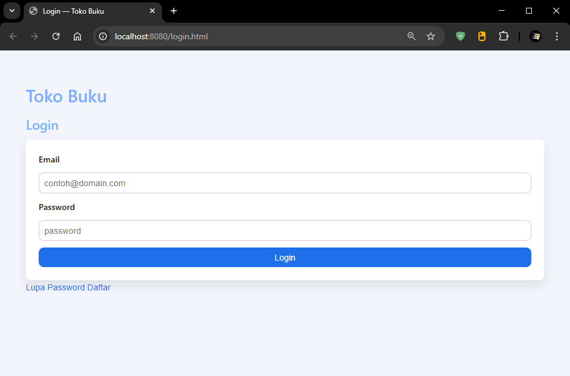
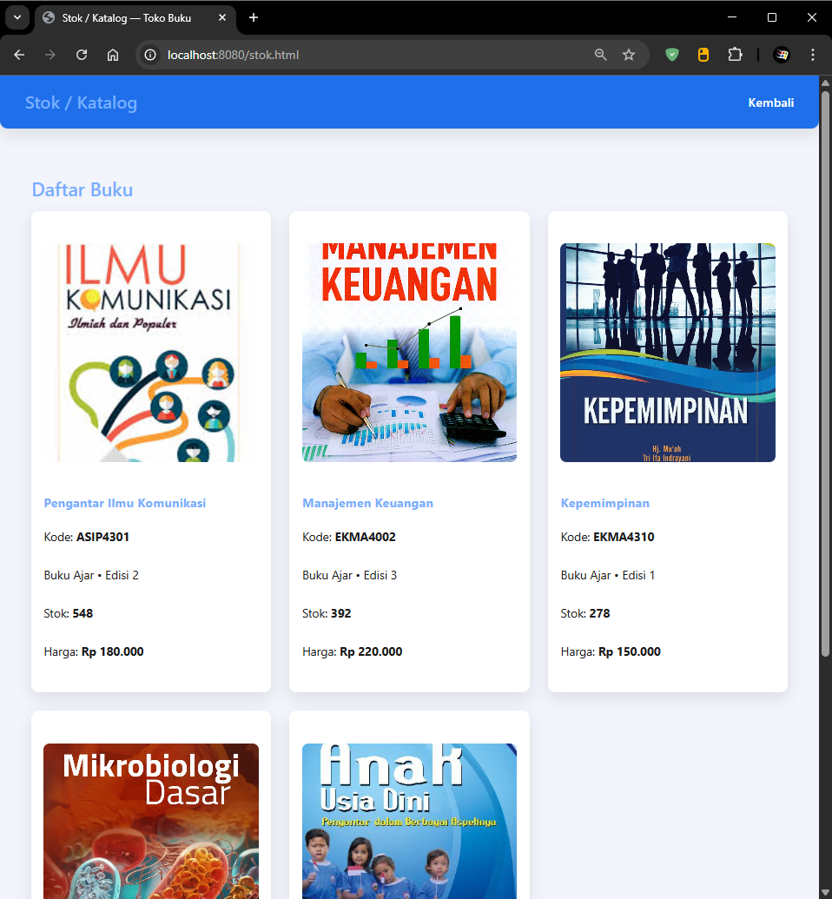
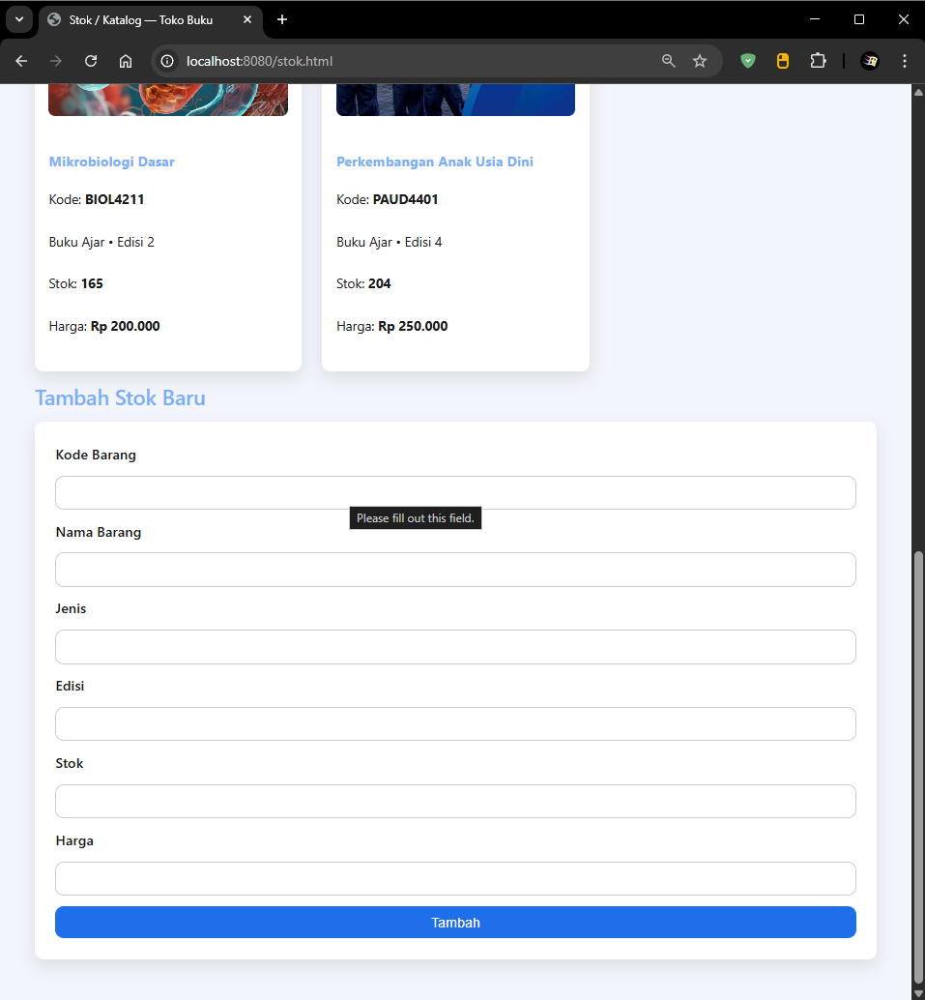
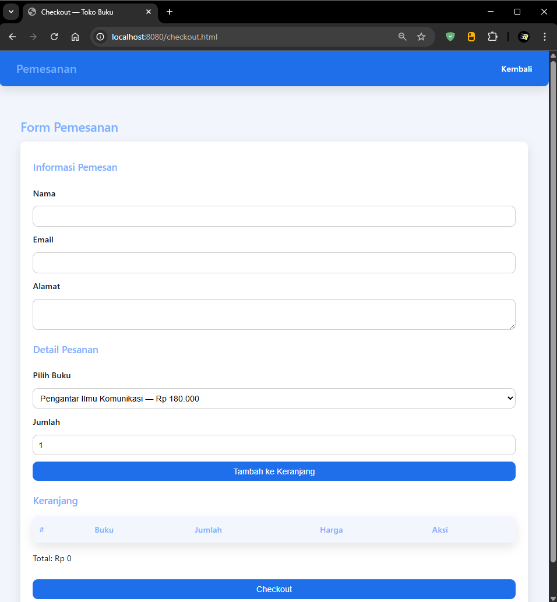
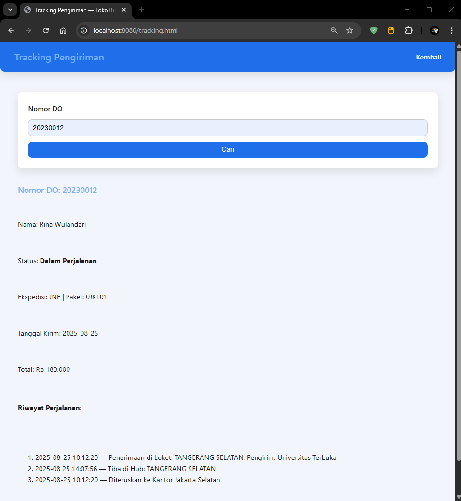

# UTSWEB

- Nama : Roufan Awaluna Romadhon
- NIM : 312410423
- Kelas : TI.24.A.3

---

## Deskripsi

Disini saya membuat Project Web Toko Buku dengan data.js yang telah dikasih, tugas ini bertujuan untuk penilaian ujian tengah semester.

## Tugas Utama

Membuat Struktur folder :
```
UTSWEB/
├── login.html
├── dashboard.html
├── stok.html
├── tracking.html
├── css/
│   └── style.css
├── js/
│   └── data.js
│   └── script.js
└── img/
    └── ...
```

Sesuai data ada 2 user dan 1 admin yaitu:
- user: rina@gmail.com / pass: rina123
- user: agus@gmail.com / pass: agus123
- admin: siti@gmail.com / pass: siti123

### Petunjuk Singkat

1. Buka login.html, lalu muncul tampilan ini



2. Setelah itu Login dengan akun diatas dan diarahkan ke halaman dashboard.


Tetapi karena akun ada role user dan admin, maka ada perbedaan di bagian stok/katalog.

Untuk User hanya menampilkan Katalog saja.



Sedangkan Admin ada tambahan untuk mengisi Stok.



Untuk bagian checkout seperti berikut.



Dan untuk bagian tracking seperti berikut.



### Penjelasan Singkat dan Demo Video

https://youtu.be/0M-VYluwiD4
